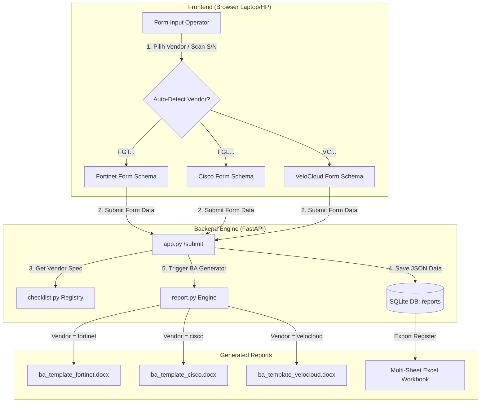
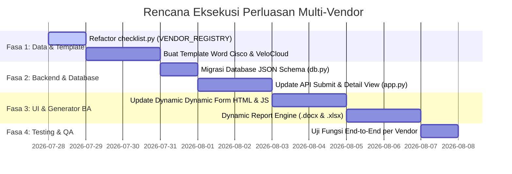

# 🏗️ Rancangan Arsitektur Perluasan SD-WAN Testing App
> **Dukungan Dynamic Berita Acara (BA) Multi-Vendor: Cisco, Fortinet, & VMware VeloCloud**

---

## 📖 1. Latar Belakang & Tujuan

Aplikasi **SD-WAN Testing App** saat ini dirancang dengan struktur *single-vendor* (Fortinet SD-WAN Edge) di mana jumlah checklist uji fungsi (6 item) dan seksi foto (5 seksi) di-hardcode pada aplikasi dan database.

Berdasarkan dokumen spesifikasi standar Telkom Indonesia ([Berita_Acara_Uji_Fungsi_SD-WAN_Edge.md](file:///c:/Users/Raka/Documents/COOLYEAHH/KaPe/sdwan-testing-app/Berita_Acara_Uji_Fungsi_SD-WAN_Edge.md)), pengujian perangkat SD-WAN Edge menggunakan **Berita_Acara_Uji_Fungsi_SD-WAN_Edge.md sebagai single source of truth** yang mencakup 3 vendor utama dengan template baseline resmi:
1. **Cisco SD-WAN Edge (ISR1100 Series)**: 6 item uji fungsi baseline, verifikasi via Cisco IOS-XE CLI (`show version`).
2. **Fortinet SD-WAN Edge**: 6 item uji fungsi baseline, verifikasi via FortiOS (GUI/CLI).
3. **VMware (VeloCloud) SD-WAN Edge**: 7 item uji fungsi baseline (termasuk SFP & GE interface), verifikasi via Local GUI / VCO.

**Tujuan Rancangan:**  
Mentransformasi aplikasi dari *Hardcoded Single-Vendor* menjadi ***Data-Driven Multi-Vendor Engine*** yang mampu merender form input, menyimpan data, dan meng-generate file Word (`.docx`) serta Excel (`.xlsx`) secara dinamis sesuai vendor yang dipilih.

---

## 🏛️ 2. Diagram Alur & Arsitektur Sistem



---

## 🧩 3. Komponen Detail Rancangan

### 3.1. Abstraksi Vendor Registry (`checklist.py`)
Registry terpusat menyimpan seluruh metadata vendor, item checklist, seksi foto, dan nama template Word terkait.

```python
VENDOR_REGISTRY = {
    "cisco": {
        "name": "Cisco SD-WAN Edge (ISR1100 Series)",
        "badge_color": "primary",
        "template_file": "ba_template_cisco.docx",
        "sn_prefix": ["FGL", "FOC"],
        "items": [
            {"key": "model", "nama": "Verifikasi Model Perangkat", "prosedur": "Cek label/tipe perangkat pada casing dan bandingkan dengan Purchase Order (PO), pastikan model perangkat sesuai dengan model yang tercantum pada PO."},
            {"key": "sn", "nama": "Verifikasi Serial Number (S/N)", "prosedur": "Cek label S/N pada perangkat dan cocokkan dengan dokumen Delivery Order. Pastikan S/N sesuai."},
            {"key": "fisik", "nama": "Pemeriksaan Kondisi Fisik", "prosedur": "Cek kondisi casing, port, dan kelengkapan aksesoris perangkat; pastikan tidak terdapat kerusakan fisik."},
            {"key": "power", "nama": "Power On Test", "prosedur": "Hidupkan perangkat, amati proses booting dan indikator LED. Pastikan perangkat menyala normal tanpa alarm."},
            {"key": "os", "nama": "Verifikasi Versi Software (IOS XE SD-WAN)", "prosedur": "Akses CLI via console/terminal, jalankan perintah 'show version'. Pastikan versi IOS XE SD-WAN sesuai standar implementasi."},
            {"key": "lan", "nama": "Uji Interface LAN", "prosedur": "Colok kabel UTP dari port LAN ke laptop, set IP satu network, cek status dengan 'show ip interface brief' dan uji ping dua arah. Pastikan status interface LAN Up/aktif."},
        ],
        "photo_sections": [
            {"key": "fisik", "judul": "Kondisi Fisik Perangkat (tampak depan, belakang, serial number)"},
            {"key": "led", "judul": "Power On Test & Indikator LED"},
            {"key": "os", "judul": "Verifikasi Versi Software via CLI"},
            {"key": "kabel", "judul": "Koneksi Kabel UTP ke Laptop per Port"},
            {"key": "status", "judul": "Status Interface"},
            {"key": "ping", "judul": "Hasil Uji Ping (Konektivitas)"},
        ]
    },
    "fortinet": {
        "name": "Fortinet SD-WAN Edge",
        "badge_color": "danger",
        "template_file": "ba_template_fortinet.docx",
        "sn_prefix": ["FGT", "FG"],
        "items": [
            {"key": "model", "nama": "Verifikasi Model Perangkat", "prosedur": "Cek label/tipe perangkat pada casing dan bandingkan dengan Purchase Order (PO); pastikan model perangkat (mis. FortiGate 40F) sesuai PO."},
            {"key": "sn", "nama": "Verifikasi Serial Number (S/N)", "prosedur": "Cek label S/N pada perangkat dan cocokkan dengan dokumen Delivery Order; pastikan S/N sesuai dokumen Delivery Order."},
            {"key": "fisik", "nama": "Pemeriksaan Kondisi Fisik", "prosedur": "Cek kondisi casing, port, dan kelengkapan aksesoris perangkat; pastikan tidak terdapat kerusakan fisik."},
            {"key": "power", "nama": "Power On Test", "prosedur": "Hidupkan perangkat, amati proses booting dan indikator LED (Power, Status, Alarm); pastikan perangkat booting normal tanpa alarm."},
            {"key": "os", "nama": "Verifikasi Versi FortiOS", "prosedur": "Akses GUI/CLI perangkat, cek versi firmware pada Dashboard/System Information atau CLI 'get system status'; pastikan versi FortiOS sesuai standar implementasi."},
            {"key": "lan", "nama": "Uji Interface LAN", "prosedur": "Colok kabel UTP dari port LAN (port1/2/3) ke laptop, set IP satu network, cek status interface pada led fortinet pastikan menyala dan uji ping dua arah; pastikan status Up."},
        ],
        "photo_sections": [
            {"key": "fisik", "judul": "Kondisi Fisik Perangkat (tampak depan, belakang, serial number)"},
            {"key": "led", "judul": "Power On Test & Indikator LED"},
            {"key": "os", "judul": "Verifikasi Versi FortiOS (GUI/CLI)"},
            {"key": "kabel", "judul": "Koneksi Fisik Kabel UTP"},
            {"key": "status", "judul": "Status Interface"},
            {"key": "ping", "judul": "Hasil Uji Ping (Konektivitas)"},
        ]
    },
    "velocloud": {
        "name": "VMware (VeloCloud) SD-WAN Edge",
        "badge_color": "warning",
        "template_file": "ba_template_velocloud.docx",
        "sn_prefix": ["VC", "VC07"],
        "items": [
            {"key": "model", "nama": "Verifikasi Model Perangkat", "prosedur": "Cek label/tipe perangkat pada casing dan bandingkan dengan Purchase Order (PO); pastikan model Edge (mis. Edge 710) sesuai PO."},
            {"key": "sn", "nama": "Verifikasi Serial Number (S/N)", "prosedur": "Cek label S/N pada perangkat dan cocokkan dengan dokumen Delivery Order; pastikan S/N sesuai."},
            {"key": "fisik", "nama": "Pemeriksaan Kondisi Fisik", "prosedur": "Cek kondisi casing, port, dan kelengkapan aksesoris perangkat; pastikan tidak terdapat kerusakan fisik."},
            {"key": "power", "nama": "Power On Test", "prosedur": "Hidupkan perangkat, amati proses booting; pastikan perangkat booting normal tanpa alarm, pastikan seluruh LED menunjukkan status normal."},
            {"key": "os", "nama": "Verifikasi Versi Software Edge", "prosedur": "Cek versi software Edge melalui GUI lokal; pastikan versi sesuai standar implementasi."},
            {"key": "sfp", "nama": "Uji Interface SFP", "prosedur": "Colok modul SFP beserta kabel fiber optik pada port SFP; amati status interface pada GUI lokal; pastikan status Up"},
            {"key": "ge", "nama": "Uji Interface GE", "prosedur": "Colok kabel UTP dari port LAN ke laptop; amati status interface pada GUI lokal; pastikan status Up."},
        ],
        "photo_sections": [
            {"key": "fisik", "judul": "Kondisi Fisik Perangkat (tampak depan, belakang, serial number)"},
            {"key": "led", "judul": "Power On Test & Indikator LED"},
            {"key": "os", "judul": "Verifikasi Versi Software via Local GUI"},
            {"key": "kabel", "judul": "Koneksi Kabel UTP dan SFP ke Laptop per Port"},
            {"key": "status", "judul": "Status Link Interface (Local GUI/VCO)"},
            {"key": "ping", "judul": "Hasil Uji Ping (Konektivitas)"},
        ]
    }
}
```

---

### 3.2. Skema & Migrasi Database (`db.py`)

Gunakan kolom `vendor` (`TEXT`) dan `checklist_json` (`TEXT`) pada tabel `reports` untuk fleksibilitas maksimal tanpa skema kaku `hasil1..hasil6`.

#### Skema Baru SQL:
```sql
CREATE TABLE IF NOT EXISTS reports (
    id INTEGER PRIMARY KEY AUTOINCREMENT,
    serial_number TEXT NOT NULL,
    vendor TEXT NOT NULL DEFAULT 'fortinet',
    type_device TEXT,
    lokasi TEXT,
    tanggal TEXT,
    petugas TEXT,
    saksi TEXT,
    saksi2 TEXT,
    saksi3 TEXT,
    checklist_json TEXT, -- JSON String: {"item_key": {"hasil": "OK", "ket": "..."}}
    catatan TEXT,
    status TEXT,         -- PASS / FAIL
    created_at TIMESTAMP DEFAULT CURRENT_TIMESTAMP
);
```

#### Langkah Migrasi Otomatis (`db.py`):
```python
def init_db():
    conn = get_conn()
    # Cek & Tambah kolom vendor dan checklist_json jika belum ada
    columns = [c["name"] for c in conn.execute("PRAGMA table_info(reports)").fetchall()]
    if "vendor" not in columns:
        conn.execute("ALTER TABLE reports ADD COLUMN vendor TEXT DEFAULT 'fortinet'")
    if "checklist_json" not in columns:
        conn.execute("ALTER TABLE reports ADD COLUMN checklist_json TEXT")
    conn.commit()
    conn.close()
```

---

### 3.3. Logika Form & UI Dinamis (`form.html` & `app.py`)

1. **Auto-Detect Vendor berdasarkan S/N Scan:**
   Saat barcode diketik/discan:
   ```javascript
   function detectVendor(sn) {
       sn = sn.toUpperCase();
       if (sn.startsWith("FGT") || sn.startsWith("FG")) return "fortinet";
       if (sn.startsWith("FGL") || sn.startsWith("FOC")) return "cisco";
       if (sn.startsWith("VC")) return "velocloud";
       return "fortinet"; // default
   }
   ```
2. **Dynamic Options Dropdown (`OK`, `NOT OK`):**
   Setiap item pengujian diisi dengan opsi `OK` atau `NOT OK` sesuai standar template Berita Acara.
3. **Penentuan Status Lulus/Gagal (`status`):**
   * `PASS` : Jika seluruh item pengujian bernilai `OK`.
   * `FAIL` : Jika ada setidaknya 1 item bernilai `NOT OK`.

---

### 3.4. Generator Word Berita Acara Dinamis (`report.py`)

Fungsi `generate_ba()` akan memilih template `.docx` yang sesuai dengan vendor dan merender tabel checklist secara presisi.

```python
def generate_ba(report: dict, photos_by_section: dict, out_path: Path) -> Path:
    vendor_key = report.get("vendor", "fortinet")
    vendor_spec = VENDOR_REGISTRY.get(vendor_key, VENDOR_REGISTRY["fortinet"])
    
    template_path = BASE_DIR / vendor_spec["template_file"]
    doc = Document(template_path)
    
    # 1. Isi Identitas Perangkat (Tabel 0)
    # 2. Isi Checklist Dinamis (Tabel 1)
    checklist_data = json.loads(report.get("checklist_json", "{}"))
    check_table = doc.tables[1]
    
    for i, item in enumerate(vendor_spec["items"], start=1):
        data = checklist_data.get(item["key"], {})
        hasil = data.get("hasil", "")
        ket = data.get("ket", "")
        
        color = GREEN if hasil == "OK" else (RED if hasil == "NOT OK" else None)
        _set_cell_text(check_table.rows[i].cells[3], hasil, bold=True, color=color)
        _set_cell_text(check_table.rows[i].cells[4], ket)
        
    # 3. Isi Foto per Seksi (Tabel 2 dst.)
    # 4. Isi Catatan & Tanda Tangan
    doc.save(out_path)
    return out_path
```

---

### 3.5. Multi-Sheet Excel Register Export (`app.py`)

Saat pengguna mengunduh register (`/export`), file `.xlsx` akan dipisah menjadi sheet terpisah per vendor:

* 📄 **Sheet 1**: `Register Cisco` (6 kolom item)
* 📄 **Sheet 2**: `Register Fortinet` (6 kolom item)
* 📄 **Sheet 3**: `Register VeloCloud` (7 kolom item)

---

## 🗓️ 4. Roadmap & Rencana Implementasi



---

## ✅ 5. Rencana Verifikasi (Testing Plan)

1. **Uji Input Cisco**: Input Cisco ISR1100 (6 item + 6 foto), pastikan BA ter-generate dengan template Cisco.
2. **Uji Input Fortinet**: Input data FortiGate (6 item + 6 foto), pastikan BA ter-generate sesuai format Fortinet.
3. **Uji Input VeloCloud**: Input VeloCloud Edge 710 (7 item + 6 foto), pastikan status `PASS` dan BA VeloCloud tercetak rapi.
4. **Uji Bulk Zip & Excel**: Pastikan pengunduhan massal Zip memuat Berita Acara dari gabungan berbagai vendor tanpa error.
